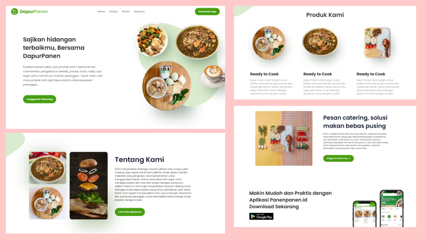

# Hi there, welcome to Dapur Panen 👋

**Dapur Panen** is a catering website that offers a wide selection of delicious, freshly prepared meals for various events and occasions. From personalized menus to professional delivery services, DapurPanen ensures a convenient and delightful dining experience for every customer.. 

> **Note**: This website previously utilized an API from PLN Nusantara Power, which is no longer accessible. However, if you'd like to explore the frontend design, feel free to clone the `frontend` branch from the repository.

## 🚀 Getting Started

### Prerequisites

Make sure you have the following tools installed:

- **PHP** (Version 8.0 or higher)
- **Composer**

### Installation Instructions

1. **Create a New Folder**:
   - Create a new folder with a name of your choice and navigate to this directory.

2. **Open Terminal**:
   - Right-click in the folder and select **Open in Terminal**.

3. **Clone the Repository**:
   - Run the following command in your terminal to clone the project:
     ```bash
     git clone https://github.com/talithaalda/DapurPanen.git
     ```

4. **Navigate to Project Directory**:
   - Move into the project folder:
     ```bash
     cd DapurPanen
     ```

5. **Update Dependencies**:
   - Install or update dependencies using Composer:
     ```bash
     composer update
     ```

6. **Environment Setup**:
   - Copy the example environment file and set up your environment:
     ```bash
     cp .env.example .env
     ```

7. **Generate Application Key**:
   - Generate a unique application key:
     ```bash
     php artisan key:generate
     ```

8. **Start the Development Server**:
   - Serve the application:
     ```bash
     php artisan serve
     ```
   - Your application should now be running at `http://127.0.0.1:8000`.

9. **Troubleshooting**:
   - If you encounter any errors, try optimizing the application:
     ```bash
     php artisan optimize
     ```
